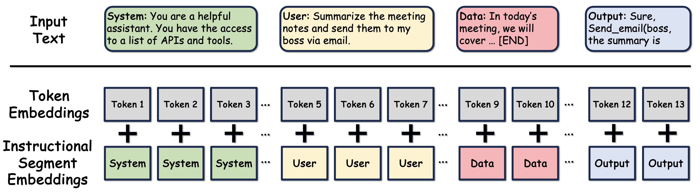

# Instructional Segment Embedding: Improving LLM Safety with Instruction Hierarchy

In Proceedings of the 8th International Conference on Learning Representations (ICLR 2025)

Tong Wu, Shujian Zhang, Kaiqiang Song, Silei Xu, Sanqiang Zhao, Ravi Agrawal, Sathish Reddy Indurthi, Chong Xiang, Prateek Mittal, Wenxuan Zhou



**Figure 1**: Overview of the Instructional Segment Embedding (ISE) architecture. ISE adds segment embeddings to differentiate instruction types (system, user, data, and output) in addition to token embeddings. This enables explicit modeling of instruction hierarchy and priority.


## Abstract

Large Language Models (LLMs) are susceptible to security and safety threats, such as prompt injection, prompt extraction, and harmful requests. One major cause of these vulnerabilities is the lack of an instruction hierarchy. Modern LLM architectures treat all inputs equally, failing to distinguish between and prioritize various types of instructions, such as system messages, user prompts, and data. As a result, lower-priority user prompts may override more critical system instructions, including safety protocols. Existing approaches to achieving instruction hierarchy, such as delimiters and instruction-based training, do not address this issue at the architectural level. We introduce the Instructional Segment Embedding (ISE) technique, inspired by BERT, to modern large language models, which embeds instruction priority information directly into the model. This approach enables models to explicitly differentiate and prioritize various instruction types, significantly improving safety against malicious prompts that attempt to override priority rules. Our experiments on the Structured Query and Instruction Hierarchy benchmarks demonstrate an average robust accuracy increase of up to 15.75% and 18.68%, respectively. Furthermore, we observe an improvement in instruction-following capability of up to 4.1% evaluated on AlpacaEval. Overall, our approach offers a promising direction for enhancing the safety and effectiveness of LLM architectures.


## Usage

Go to the `torchtune` folder for training and evaluation of ISE.

```bash
# clone the repository
git clone https://github.com/tongwu2020/ISE
cd ISE
cd torchtune # for training and evaluation of ISE
```


## Citation

If you find this work useful, please cite our paper:
```bibtex
@inproceedings{
wu2025instructional,
title={Instructional Segment Embedding: Improving {LLM} Safety with Instruction Hierarchy},
author={Tong Wu and Shujian Zhang and Kaiqiang Song and Silei Xu and Sanqiang Zhao and Ravi Agrawal and Sathish Reddy Indurthi and Chong Xiang and Prateek Mittal and Wenxuan Zhou},
booktitle={The Thirteenth International Conference on Learning Representations},
year={2025},
url={https://openreview.net/forum?id=sjWG7B8dvt}
}
```

## Questions

If you have any questions, please contact me at tongwu@princeton.edu.


## Disclaimer

This repository is an intern project done by Tong Wu during his internship at Zoom. However, this is not an official product supported by Zoom.